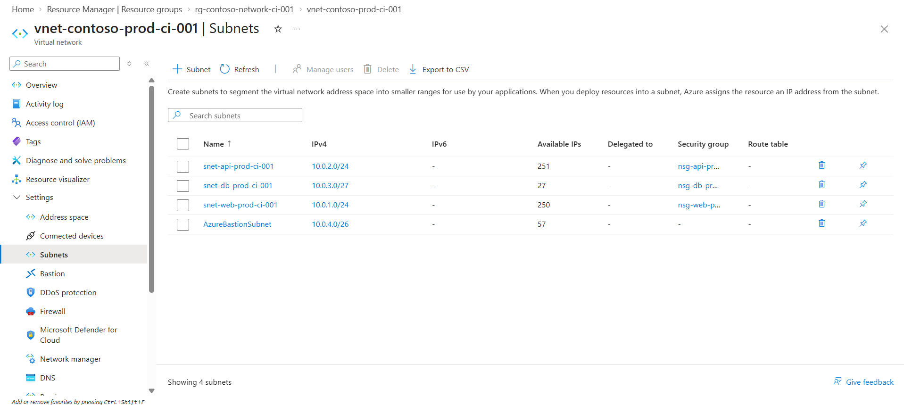
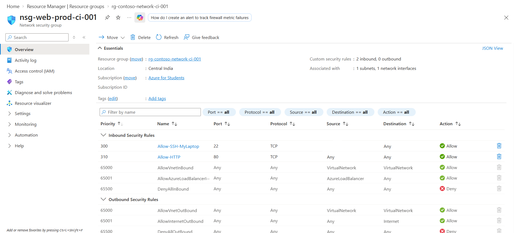
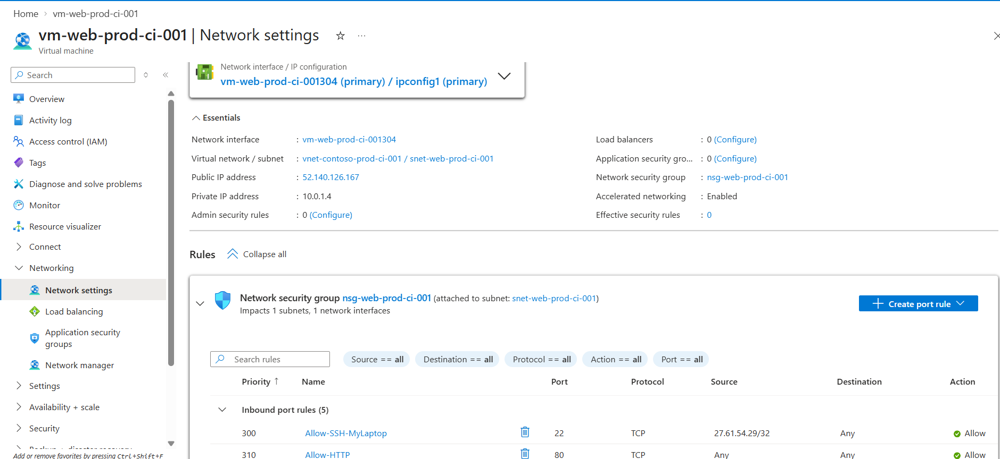

# Contoso Retail Azure Cloud Infrastructure

> A practical Azure Cloud Engineering project demonstrating secure networking, Linux administration, Dockerized application deployment, Azure SQL integration, monitoring, backup, and GitHub Actions CI/CD.

## 📌 Project Overview

This project demonstrates the migration and deployment of a web application for **Contoso Retail Ltd** onto Microsoft Azure.

The application runs on an Azure Linux VM using Docker and Nginx, while Azure SQL Database provides the managed database layer.

The project also implements automated CI/CD using GitHub Actions and a self-hosted runner hosted on the Azure VM.

### Objectives

- Deploy a web application on Azure
- Implement VNet-based network architecture
- Secure VM access using NSGs and Azure Bastion
- Containerize the application using Docker
- Use Azure SQL Database as the managed database
- Implement monitoring and backup
- Automate testing and deployment using GitHub Actions
- Troubleshoot real-world cloud deployment issues

## 🏗️ Architecture

```text
                         Internet
                            |
                            | HTTP :80
                            v
                +----------------------+
                |     Azure Web VM     |
                |  Ubuntu 24.04 LTS    |
                | vm-web-prod-ci-001   |
                +----------+-----------+
                           |
                         Nginx
                           |
                    127.0.0.1:5000
                           |
                           v
                +----------------------+
                |   Docker Container   |
                |      Flask App       |
                +----------+-----------+
                           |
                           | SQL
                           v
                +----------------------+
                |   Azure SQL Database |
                +----------------------+

             Administration
                    |
                    v
             Azure Bastion
                    |
                    v
                 Azure VM

             CI/CD
                    |
                    v
             GitHub Actions
                    |
                    v
          Self-hosted Runner
                on VM
                    |
                    v
                 Docker
```

## ☁️ Azure Services Used

| Service | Purpose |
|---|---|
| Azure Virtual Network | Network isolation |
| Azure Subnets | Network segmentation |
| Network Security Group | Control inbound VM traffic |
| Azure Virtual Machine | Hosts the application |
| Azure Bastion | Secure VM administration |
| Azure SQL Database | Managed relational database |
| Azure Monitor / Application Insights | Monitoring |
| Azure Backup | VM backup |
| Microsoft Entra ID | Identity and access management |
| Managed Identity | Azure resource identity |
| Docker | Application containerization |
| Nginx | Reverse proxy |
| GitHub Actions | CI/CD automation |

## 🌐 Network Architecture







### VNet

**VNet:** `vnet-contoso-prod-ci-001`

**Address space:** `10.0.0.0/16`

### Subnets

| Subnet | Address Range | Status |
|---|---|---|
| `snet-web-prod-ci-001` | `10.0.1.0/24` | Used |
| `snet-api-prod-ci-001` | `10.0.2.0/24` | Planned / unused |
| `snet-db-prod-ci-001` | `10.0.3.0/27` | Planned / unused |
| `AzureBastionSubnet` | `10.0.4.0/26` | Used |

### Architecture Note

The API and database subnets were included in the original network design but are currently unused.

The Flask application runs on the web VM, while Azure SQL Database is a managed PaaS service and is not deployed inside the database subnet.

This README intentionally distinguishes between **planned** and **actually deployed** components.

## 🔐 Network Security

The active web subnet uses:

`nsg-web-prod-ci-001`

### HTTP

```text
Internet
   |
 TCP 80
   |
Web VM
```

HTTP traffic is allowed to reach the web application.

### SSH

SSH access is restricted to the administrator's known public IP rather than allowing SSH from the entire Internet.

```text
Administrator IP
       |
     TCP 22
       |
      VM
```

### Azure Bastion

Azure Bastion provides secure browser-based administrative access to the VM.

## 🖥️ Application Infrastructure





**VM:** `vm-web-prod-ci-001`

**Operating System:** Ubuntu 24.04 LTS

Application stack:

```text
Nginx
  |
Docker
  |
Flask
  |
Azure SQL Database
```

The Flask application listens internally on:

`127.0.0.1:5000`

Docker exposes the application only on the localhost interface.

Nginx handles incoming HTTP traffic on port 80 and forwards requests to Flask.

## 🐳 Docker

The Flask application is packaged into a Docker image and deployed as:

`contoso-container`

The container uses:

```text
--restart unless-stopped
```

Application configuration is provided through:

`/opt/contoso-app/.env`

The `.env` file is excluded from Git using `.gitignore`.

No application secrets are committed to the public repository.

## 🗄️ Azure SQL Database

The application uses **Azure SQL Database** as its managed relational database.

Architecture:

```text
Azure SQL Logical Server
          |
          v
Azure SQL Database
```

The Flask `/products` endpoint successfully retrieves records from Azure SQL.

Example:

```json
[
  {
    "id": 1,
    "name": "Laptop",
    "price": 75000.0,
    "stock": 10
  },
  {
    "id": 2,
    "name": "Keyboard",
    "price": 2500.0,
    "stock": 25
  },
  {
    "id": 3,
    "name": "Mouse",
    "price": 1200.0,
    "stock": 40
  }
]
```

> This project uses **Azure SQL Database**, not Azure SQL Managed Instance.

## 📊 Monitoring

Azure Monitor and Application Insights are used to monitor the application and infrastructure.

Monitoring provides visibility into:

- Application performance
- Application logs
- VM/resource health
- Operational activity

The originally planned `rg-contoso-monitoring-ci-001` is currently unused.

## 💾 Backup

Azure Backup is configured to protect the deployed VM.

Azure Backup resources are associated with:

`AzureBackupRG_centralindia_1`

This provides a recovery mechanism for the VM infrastructure.

## 👤 Identity and Access Management

The Azure VM has a **system-assigned managed identity** enabled.

The managed identity provides the VM with an identity in Microsoft Entra ID without requiring credentials to be stored in application code.

No unnecessary broad RBAC permissions were added to the VM managed identity.

## 🔄 CI/CD

GitHub Actions is used for automated testing and deployment.


.png)
### Continuous Integration

```text
GitHub
   |
   v
GitHub-hosted runner
   |
Python 3.12
   |
Install dependencies
   |
pytest
   |
PASS
```

CI runs automated Python tests before deployment.

## 🚀 Continuous Deployment

The CD pipeline uses a **self-hosted GitHub Actions runner** installed on the Azure VM.

```text
GitHub
   |
   v
Self-hosted Runner
   |
Azure VM
   |
Docker Build
   |
Docker Container
   |
Flask
```

### Deployment Process

1. Code is pushed to the `main` branch.
2. GitHub Actions runs CI tests.
3. The self-hosted runner executes the deployment.
4. Application files are synchronized to the VM.
5. A Docker image is built.
6. The previous container is removed.
7. The new container starts.
8. Application health is checked.
9. The database-backed endpoint is tested.
10. Unused Docker images are cleaned up.

## 🧪 Health Checks


The deployment validates:

### Application health

`/health`

### Database-backed endpoint

`/products`

The `/products` endpoint validates the application-to-database path:

```text
Flask
  |
Azure SQL
  |
Product data
```


## 🔒 Security Practices

- SSH restricted to a known administrator IP
- Port 5000 not publicly exposed
- Nginx used as the public application entry point
- Azure Bastion available for secure administration
- Application secrets kept outside Git
- `.env` included in `.gitignore`
- VM Managed Identity enabled
- Unnecessary RBAC permissions avoided
- Planned but unused API/DB NSGs are not represented as active security controls

## 📁 Repository Structure

```text
contoso-app/
|
├── .github/
│   └── workflows/
│       ├── ci.yml
│       └── deploy.yml
|
├── docs/
│   └── screenshots/
|
├── app.py
├── Dockerfile
├── requirements.txt
├── .gitignore
└── README.md
```

## 📸 Project Evidence

Screenshots document:

- Azure resource groups
- VNet
- Subnets
- Web NSG
- NSG association
- Azure VM
- VM networking
- Azure Bastion
- Azure SQL Database
- Running application
- `/products` database endpoint
- Docker container
- Successful CI pipeline
- Successful CD pipeline
- Self-hosted GitHub runner
- Runner service
- Application health checks
- Azure Backup

Sensitive information such as passwords, private keys, tokens, connection strings, subscription IDs, and personal IP addresses should be redacted before publishing screenshots.

## ⚖️ Architecture Decisions

This project intentionally focuses on a practical Azure Cloud Engineer implementation rather than unnecessary enterprise complexity.

The following services were considered during the architecture phase but were **not deployed**:

- AKS
- Azure Container Apps
- Azure App Service
- Azure Functions
- Application Gateway
- Azure Front Door
- Azure SQL Managed Instance
- Dedicated database VM
- Multi-region deployment

The final implementation uses a single-region, VM-based application architecture.

This keeps the project focused while demonstrating practical cloud engineering skills.

## 🔮 Future Improvements

Possible future improvements include:

- Terraform infrastructure as code
- GitHub Actions OIDC authentication with Azure
- Azure Key Vault integration
- Private Endpoint for Azure SQL
- More restrictive network architecture
- High availability
- Automated infrastructure deployment

These are future improvements and are **not part of the current deployed architecture**.

## 🎯 Skills Demonstrated

### Azure

- Virtual Networks
- Subnets
- NSGs
- Azure Bastion
- Azure Virtual Machines
- Azure SQL Database
- Azure Monitor
- Application Insights
- Azure Backup
- Microsoft Entra ID
- Managed Identity

### Linux

- Ubuntu administration
- SSH
- Nginx
- systemd
- Linux permissions
- Application deployment

### Containers

- Docker
- Docker images
- Docker containers
- Container deployment

### Application

- Python
- Flask
- REST API
- SQL database integration

### DevOps

- Git
- GitHub
- GitHub Actions
- CI/CD
- Self-hosted runners
- Automated testing
- Automated deployment

### Troubleshooting

- Network connectivity
- SSH failures
- Database connectivity
- Docker deployment
- Linux permissions
- CI/CD failures

## 🏁 Project Status

**Completed**

The Azure infrastructure, application, monitoring, backup, and CI/CD pipeline have been implemented and tested successfully.

The architecture has intentionally been kept focused rather than expanded with unnecessary enterprise services.
